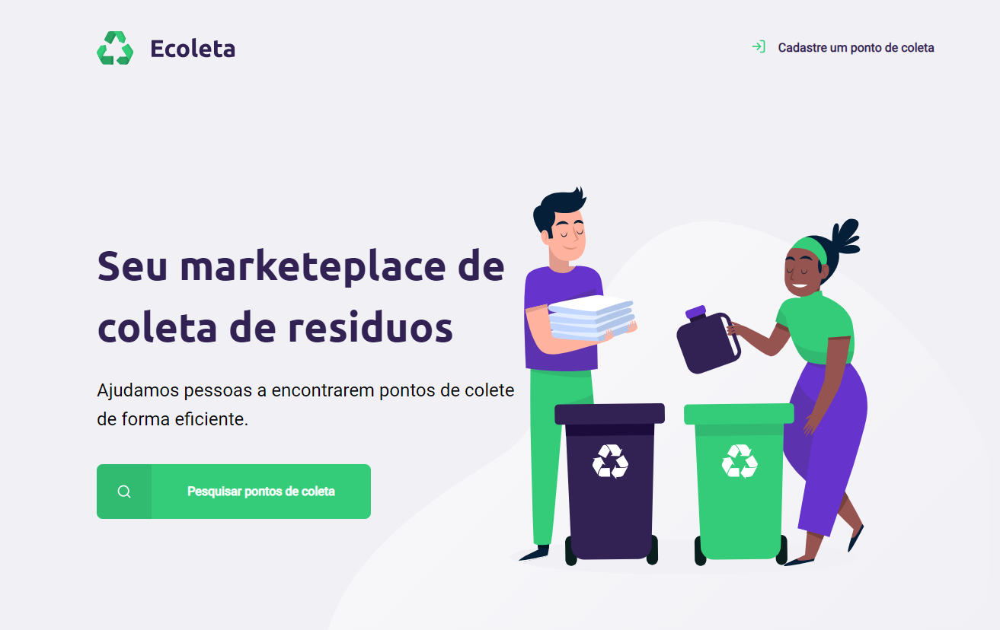

<div align="center">
  <h1>Ecoleta</h1>
  <p>Projeto com proposta de criar uma rede de pontos reciclagens.</p>
  
</div>

# 📒 Índice
* [Descrição](#descrição)
* [Requisitos Funcionais](#requisitos)
  * [Features](#features)
* [Tecnologias](#tecnologias)
* [Design](#design)
  * [Cores](#cores)
  * [Fontes](#fontes)
* [Instalação](#instalação)
* [Licença](#licença)

# 📃 <span id="descrição">Descrição</span>
Projeto com proposta de criar uma rede de pontos reciclagens, auxiliando as pessoas a encontrarem pontos de coleta de forma eficiente. Projeto proposto pela [**@Rocketseat**](https://github.com/Rocketseat) na Next Level Week#1.

# 📌 <span id="requisitos">Requisitos Funcionais</span>
- [x] Cadastro de pontos<br>
- [x] Cadastro de pontos<br>
- [x] Tipos de Coleta<br>
- [x] Consulta de pontos de coleta por cidade<br>
- [x] Exibição de dados detalhados de pontos de coleta<br>

## Features
- [x] Requisição a IBGE API<br>
- [x] Responsividade<br>

# 💻 <span id="tecnologias">Tecnologias</span>
- **HTML**
- **CSS**
- **JavaScript**
- **Express**
- **nodemon**
- **nunjucks**
- **SQLite3**

# 🎨 <span id="design">Design</span>
- O modelo final para versão desktop e mobile está disponível na pasta `./design`

- <span id="cores">Cores<br></span>
  * #322153<br>
  * #34cb79<br>
  * #f0f0f5<br>

- <span id="fontes">Fontes<br></span>
  * Ubuntu, sans-serif

# 🚀 <span id="instalação">Instalação</span>
```bash
  # Clone este repositório:
  $ git clone https://github.com/CleilsonAndrade/ecoleta-nlw-1
  $ cd ./ecoleta-nlw-1
```

# 📝 <span id="licença">Licença</span>
Esse projeto está sob a licença MIT. Veja o arquivo [LICENSE](LICENSE) para mais detalhes.

---

<p align="center">
  Feito com 💜 by CleilsonAndrade
</p>